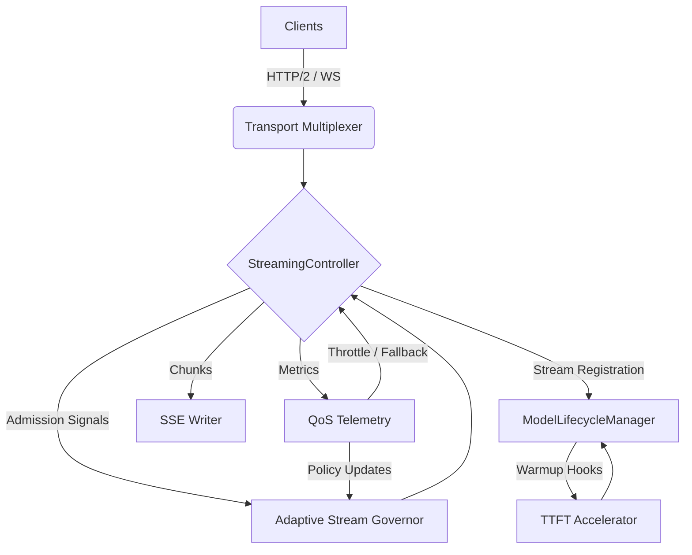

# Phase 4 Implementation Guide – Advanced Stream Optimization

> Great architecture is invisible – it enables teams, evolves gracefully, and pays dividends over decades.

Phase 4 unlocks the streaming subsystem built in Phase 3 by making it predictable, transport-efficient, and self-governing under load. This guide translates the scope definition into a concrete plan implementers can follow without rediscovering architectural intent. Use it jointly with the ADR log, `config/runtime.yaml`, and the streaming benchmark harness.

---

## 0. How to Use This Guide

1. **Read Section 1** to understand how each deliverable plugs into the existing StreamingController, ConnectionPool, and ModelLifecycleManager.
2. **Use Section 2** as the authoritative specification for each deliverable (interfaces, configs, error semantics).
3. **Reference Section 3** when mapping work to files or implementing algorithms shared between TypeScript and Python runtimes.
4. **Apply Section 4** to plan tests and acceptance criteria before writing code.
5. **Follow Section 5** for rollout governance and coordinated flag management.
6. **Track Section 6 metrics** to declare success or trigger remediation.
7. Update `.automatosx/abilities/our-architecture-decisions.md` with new ADRs that emerge from implementation.

---

## 1. Architectural Integration Overview

### 1.1 Phase 3 Baseline Recap

- **StreamingController (TypeScript)**: Coordinates stream admission, chunk routing, and lifecycle callbacks. Exposes hooks for admission control, telemetry, and cleanup.
- **ConnectionPool (TypeScript)**: Maintains outbound HTTP/1.1 connections per client session; currently serialized due to lack of multiplexing. Features chunk pooling utilities.
- **ModelLifecycleManager (Python)**: Handles model warmup, batching windows, and per-request execution context. Emits lifecycle events consumed by StreamingController.
- **Metrics Spine**: Lightweight per-stream metrics emitted via `streamMetricsEmitter`. Currently captures TTFT, tokens/sec, and error reasons but not yet used for control loops.
- **Safe Mode Constraints**: Adaptive limits disabled, HTTP/1.1 transport, conservative batching, no TTFT pipelining, minimal QoS policies.

### 1.2 Phase 4 Integration Summary

| Deliverable | Primary Module | New Components | Key Integration Points | Runtime Touchpoints |
|-------------|----------------|----------------|------------------------|----------------------|
| 4.1 Adaptive Stream Governor | `src/streaming/governor` | PID controller, deterministic cleanup scheduler | StreamingController hooks (`onStreamStart`, `onStreamEnd`), StreamRegistry, metrics bus | TS runtime with signals to Python via gRPC metadata |
| 4.2 Transport Multiplexing | `src/transport/http2`, `src/transport/ws` | HTTP/2 pool manager, SSE writer, WebSocket gateway | ConnectionPool, StreamingController chunk dispatch, TLS config | TS runtime (Node HTTP/2) with optional envoy/nghttp2 config |
| 4.3 TTFT Accelerator | `src/streaming/pipeline/ttft` + `python/runtime/ttft.py` | Tokenizer warm queue, KV prep hook, speculation toggle | StreamingController admission, ModelLifecycleManager, Python worker queue | Shared protobuf/gRPC metadata ensuring hints cross boundary |
| 4.4 Stream QoS Telemetry | `src/streaming/qos` | SLO evaluator, policy engine, remediation executor | Metrics bus, Config service, Feature Flag manager, StreamingController overrides | TS control-plane logic plus Python signals for throttling |

### 1.3 Control & Data Flow Diagram



### 1.4 Integration Principles

1. **Single Source of Truth**: StreamingController remains the orchestration nexus. All new components publish/subscribe via its event hooks rather than bypassing it.
2. **Backpressure Transparency**: Transport upgrades propagate flow-control back to the governor to avoid over-admission.
3. **Config-Driven Behavior**: All tunables live in `config/runtime.yaml` under `streaming.phase4`. Feature flags gate each deliverable.
4. **Idempotent Cleanup**: Stream cleanup events must be idempotent to avoid double-free or leaked resources when the control loop retries.
5. **Python Coordination via Metadata**: TS components communicate load hints to Python using existing gRPC metadata envelope to avoid schema drift.

### 1.5 Dependency Touchpoints

- **PID controller** depends on accurate TTFT + utilization metrics; ensure metrics emitter publishes at <250 ms intervals.
- **HTTP/2 pool manager** requires Node.js 20+ `http2` module and TLS certificates configured via `config/transport.yaml`.
- **TTFT accelerator** adds new queue priorities to `ModelLifecycleManager`; requires cross-language schema update.
- **QoS policy engine** assumes streaming metrics persisted for at least 60 s sliding window; extend in-memory store accordingly.

---

## 2. Component Specifications

### 2.1 Deliverable 4.1 – Adaptive Stream Governor

#### 2.1.1 Responsibilities

- Enforce concurrency limits per tenant and globally using adaptive control loop.
- Repair race condition where StreamRegistry cleanup lagged behind stream termination events.
- Emit admission decisions (admit, defer, reject, safe-mode fallback) to StreamingController.
- Re-enable `adaptive_limits` flag with PID-tuned target TTFT and utilization thresholds.

#### 2.1.2 Interfaces & Type Definitions (TypeScript)

```ts
export interface StreamGovernorConfig {
  featureFlag: boolean;
  targetTtftMs: number; // e.g., 550
  maxConcurrentStreams: number;
  minConcurrentStreams: number;
  tenantBudgets: Record<string, TenantBudget>;
  pid: {
    kp: number;
    ki: number;
    kd: number;
    integralSaturation: number;
    sampleIntervalMs: number;
  };
  cleanup: {
    sweepIntervalMs: number;
    maxStaleLifetimeMs: number;
  };
}

export interface TenantBudget {
  tenantId: string;
  hardLimit: number;
  burstLimit: number;
  decayMs: number;
}

export interface AdaptiveControlSignal {
  streamId: string;
  tenantId: string;
  measuredTtftMs: number;
  utilization: number; // GPU utilization 0-1
  recommendation: 'admit' | 'queue' | 'reject' | 'safe-mode';
  reason: string;
  sampleWindowMs: number;
}

export interface StreamCleanupEvent {
  streamId: string;
  closedAt: number;
  reason: 'complete' | 'error' | 'timeout';
}
```

#### 2.1.3 Deterministic Cleanup Scheduler

- Subscribe to `StreamingController.onStreamEnd`.
- Push `StreamCleanupEvent` into `CleanupQueue` ordered by `closedAt`.
- Background worker sweeps every `cleanup.sweepIntervalMs`; removes streams from registry if `now - closedAt >= cleanupDelay`.
- Maintains monotonic cursor to prevent reprocessing.

#### 2.1.4 Integration Points

1. `StreamingController.requestAdmission`: calls `AdaptiveGovernor.evaluate(tenantId, hints)`.
2. `StreamRegistry`: governor uses it to count active streams per tenant.
3. `ModelLifecycleManager`: receives `safe-mode` signals to reduce batch size when governor detects instability.
4. `MetricsEmitter`: writes PID internal state for observability (gain adjustments, integral clamp events).

#### 2.1.5 Configuration (YAML)

```yaml
streaming:
  phase4:
    adaptive_governor:
      enabled: true
      target_ttft_ms: 550
      max_concurrent: 80
      min_concurrent: 16
      pid:
        kp: 0.35
        ki: 0.08
        kd: 0.15
        integral_saturation: 200
        sample_interval_ms: 200
      cleanup:
        sweep_interval_ms: 100
        max_stale_lifetime_ms: 500
      tenant_budgets:
        default:
          hard_limit: 20
          burst_limit: 32
          decay_ms: 60000
```

#### 2.1.6 Error Handling Patterns

| Scenario | Detection | Action | Logging | Metric |
|----------|-----------|--------|---------|--------|
| PID output NaN/Inf | Guard `Number.isFinite` | Clamp to `max_concurrent` and emit safe-mode signal | `logger.warn('pid_unstable')` | `governor.pid_unstable` |
| Cleanup lag > threshold | Compare `now - closedAt` | Force cleanup + emit alert | `logger.error('cleanup_stall', {lag})` | `governor.cleanup.lag_ms` |
| Tenant budget exceeded | `active >= hardLimit` | Return `reject` with retry-after | `logger.info('tenant_budget_block')` | `governor.tenant_rejections` |
| Metrics missing | TTL expiry on measurement window | Fallback to static limits | `logger.warn('metrics_stale')` | `governor.metrics_stale_events` |

#### 2.1.7 Dependencies & Contracts

- Requires monotonic clock source (use `process.hrtime.bigint()` via helper) to avoid drift.
- PID controller must be pure-function friendly for deterministic tests.
- Governor publishes `AdaptiveControlSignal` onto `eventBus<ControlSignal>` so QoS policy engine can subscribe.

### 2.2 Deliverable 4.2 – Transport Multiplexing & Protocol Upgrade

#### 2.2.1 Responsibilities

- Replace per-request HTTP/1.1 connections with shared HTTP/2 sessions.
- Provide SSE writer optimized for chunk reuse and header compression.
- Offer WebSocket gateway fallback for bidirectional control clients.
- Maintain ConnectionPool semantics while enabling multiplexing metrics.

#### 2.2.2 Interfaces & Type Definitions (TypeScript)

```ts
export interface Http2PoolOptions {
  maxSessions: number;
  maxStreamsPerSession: number;
  pingIntervalMs: number;
  connectTimeoutMs: number;
  tls: {
    caFile?: string;
    certFile?: string;
    keyFile?: string;
    rejectUnauthorized: boolean;
  };
}

export interface MultiplexedStreamHandle {
  streamId: string;
  sessionId: string;
  protocol: 'http2' | 'ws';
  sendChunk: (chunk: Uint8Array) => Promise<void>;
  close: (code?: number) => Promise<void>;
  onBackpressure: (cb: (state: BackpressureState) => void) => void;
}

export interface BackpressureState {
  highWatermark: number;
  bufferedBytes: number;
  consumerLagMs: number;
}

export interface SseChunk {
  event: string;
  id?: string;
  retry?: number;
  data: string;
}
```

#### 2.2.3 Integration Points

1. ConnectionPool instantiates `Http2Pool` when `protocol.http2.enabled` flag set; gracefully falls back to HTTP/1.1.
2. StreamingController obtains `MultiplexedStreamHandle` per admitted stream and routes chunks through SSE writer.
3. WebSocket gateway shares the same chunk serialization functions to prevent drift.
4. QoS policy engine can issue `protocolOverride` commands to downgrade to HTTP/1.1 when RTT variance spikes.

#### 2.2.4 Configuration (YAML)

```yaml
transport:
  http2:
    enabled: true
    max_sessions: 16
    max_streams_per_session: 100
    ping_interval_ms: 15000
    connect_timeout_ms: 200
    tls:
      ca_file: config/certs/ca.pem
      cert_file: config/certs/service.pem
      key_file: config/certs/service.key
      reject_unauthorized: true
  websocket:
    enabled: true
    max_connections: 200
    idle_timeout_ms: 600000
```

#### 2.2.5 Error Handling Patterns

| Scenario | Detection | Action | Metric |
|----------|-----------|--------|--------|
| Session GOAWAY | `session.on('goaway')` | Drain existing streams, open new session | `http2.session_rotations` |
| Stream-level RST | `stream.on('error')` with `RST_STREAM` | Retry once on new stream, else fail | `http2.stream_resets` |
| SSE writer backpressure | `response.write` returns false | Pause producer, resume on `drain` | `sse.backpressure_ms` |
| WS frame too large | `message.length > max` | Close connection code 1009 | `ws.closed_payload_too_large` |

#### 2.2.6 Benchmark Harness Hooks

- Extend `benchmarks/streaming/protocol_bench.ts` to accept `--protocol=http1|http2|ws`.
- Record TTFT, throughput, CPU, memory, and connection overhead per protocol under concurrency tiers (32/50/75/100).
- Output structured JSON for regression tracking.

### 2.3 Deliverable 4.3 – TTFT Accelerator Pipeline

#### 2.3.1 Responsibilities

- Pipeline tokenizer, admission, and Python runtime prep to minimize idle time before first token.
- Provide deterministic speculation for known prompts (system prompts, health checks).
- Instrument TTFT stages for observability.

#### 2.3.2 Interfaces (TypeScript + Python)

```ts
export interface TtftHint {
  streamId: string;
  modelId: string;
  promptHash: string;
  estimatedTokens: number;
  tenantId: string;
  speculationAllowed: boolean;
}

export interface TokenizerWarmQueue {
  enqueue(hint: TtftHint, payload: PromptPayload): Promise<void>;
  dequeue(streamId: string): Promise<WarmQueueItem | undefined>;
}

export interface SpeculativeTokenProvider {
  getCandidateTokens(promptHash: string): Promise<string[] | null>;
  recordOutcome(promptHash: string, accepted: boolean): void;
}
```

```python
@dataclass
class WarmupSignal:
    stream_id: str
    model_id: str
    prompt_hash: str
    estimated_tokens: int
    speculation_allowed: bool

class KvPrepCoordinator:
    def handle_signal(self, signal: WarmupSignal) -> None:
        cache = self._get_cache(signal.model_id)
        cache.prefetch(signal.prompt_hash)
        if signal.speculation_allowed:
            self._seed_first_token(signal.prompt_hash)
```

#### 2.3.3 Integration Points

1. StreamingController generates `TtftHint` during admission and pushes onto `TokenizerWarmQueue` before Python request dispatch.
2. `python/runtime/ttft.py` listens for `WarmupSignal` over gRPC metadata channel and begins KV prep concurrently with TS stream registration.
3. Speculative tokens reused by SSE writer when real tokens arrive; mismatch triggers rollback path to discard speculated token.
4. Metrics (TTFT stage durations) emitted through shared `metrics.ttft` namespace.

#### 2.3.4 Configuration (YAML)

```yaml
streaming:
  phase4:
    ttft_pipeline:
      enabled: true
      tokenizer_queue_size: 256
      max_hint_age_ms: 800
      speculation:
        enabled: true
        allow_list_prompt_hashes:
          - 9f2c...
          - 4ab1...
        rollback_mode: drop_first_token
```

#### 2.3.5 Error Handling Patterns

| Scenario | Detection | Action | Metric |
|----------|-----------|--------|--------|
| Warm queue overflow | `enqueue` rejects | Apply backpressure to governor, log warn | `ttft.queue_overflow` |
| Speculation mismatch | Real token != speculated | Emit correction event, re-send actual token | `ttft.speculation_miss` |
| KV prep timeout | Python hook exceeds 200 ms | Proceed without prep, mark degraded | `ttft.kv_prep_timeout` |
| Prompt hash collision | Duplicate hash diff payload | Recompute using SHA256 + prompt size, log error | `ttft.hash_collision` |

### 2.4 Deliverable 4.4 – Stream QoS Telemetry & Auto-Remediation

#### 2.4.1 Responsibilities

- Continuously evaluate TTFT, throughput, cancellations, backpressure, and rejection metrics.
- Trigger remediation actions (adjust stream limits, downgrade protocol, alert owners) when SLOs drift.
- Provide policy definitions per tenant/class of service.

#### 2.4.2 Interfaces (TypeScript)

```ts
export interface QosPolicy {
  name: string;
  tenants: string[];
  metricsWindowSec: number;
  slo:
    ttftP50Ms: number;
    ttftP95Ms: number;
    rejectionRatePct: number;
    cancellationRatePct: number;
  actions: QosAction[];
}

export type QosAction =
  | { type: 'adjust_limit'; delta: number; min?: number; max?: number; }
  | { type: 'switch_protocol'; protocol: 'http1' | 'http2' | 'ws'; }
  | { type: 'trigger_alert'; channel: 'webhook' | 'log'; severity: 'info' | 'warn' | 'critical'; }
  | { type: 'enter_safe_mode'; ttlSec: number; };

export interface SloEvaluationResult {
  policy: string;
  breached: boolean;
  breaches: Array<{ metric: string; value: number; target: number; }>;
  recommendedActions: QosAction[];
}
```

#### 2.4.3 Integration Points

1. Metrics collector stores per-stream stats in ring buffer keyed by tenant.
2. `QosEvaluator` runs every 10 s; consumes metrics window and outputs `SloEvaluationResult` events.
3. `RemediationExecutor` subscribes and applies actions (e.g., call `AdaptiveGovernor.adjustLimits(delta)`).
4. Alerts routed via existing webhook integration under `alerts.streaming` config.

#### 2.4.4 Configuration (YAML)

```yaml
streaming:
  phase4:
    qos:
      enabled: true
      evaluation_interval_sec: 10
      policies:
        - name: enterprise_default
          tenants: ['*']
          metrics_window_sec: 60
          slo:
            ttft_p50_ms: 550
            ttft_p95_ms: 900
            rejection_rate_pct: 2
            cancellation_rate_pct: 0.5
          actions:
            - type: adjust_limit
              delta: -5
              min: 20
            - type: switch_protocol
              protocol: http1
            - type: trigger_alert
              channel: webhook
              severity: warn
            - type: enter_safe_mode
              ttl_sec: 300
```

#### 2.4.5 Error Handling Patterns

| Scenario | Detection | Action | Metric |
|----------|-----------|--------|--------|
| Metrics gap | Last data point older than window | Skip evaluation, log warn | `qos.metrics_gap` |
| Remediation loop | Same action triggered >3 cycles | Escalate severity + freeze action | `qos.remediation_loop_detected` |
| Alert delivery failure | Webhook 5xx | Retry w/ backoff, log error | `qos.alert_failures` |
| Policy misconfiguration | Invalid action schema | Fail fast at startup | `qos.invalid_policy` |

---

## 3. Implementation Details

### 3.1 File and Module Organization

```
src/
  streaming/
    controller/
      StreamingController.ts
    governor/
      AdaptiveGovernor.ts
      CleanupScheduler.ts
      pid/
        pidController.ts
        pidTypes.ts
    pipeline/
      ttft/
        TokenizerWarmQueue.ts
        HintHasher.ts
        SpeculativeProvider.ts
    qos/
      QosEvaluator.ts
      RemediationExecutor.ts
      SloPolicyStore.ts
  transport/
    http2/
      Http2Pool.ts
      SessionManager.ts
      SseWriter.ts
    ws/
      WebSocketGateway.ts
python/
  runtime/
    lifecycle.py
    ttft.py
    governors/
      kv_prep_coordinator.py
benchmarks/
  streaming/
    protocol_bench.ts
    ttft_pipeline_bench.ts
```

- Keep PID logic isolated under `src/streaming/governor/pid` for reuse in QoS derived signals.
- Shared type definitions in `src/streaming/types.ts` to prevent duplication between governor/QoS/pipeline.
- Python additions stay within `python/runtime` to minimize packaging impact.

### 3.2 Key Algorithms

#### 3.2.1 PID Control Loop

1. **Sampling**: Every `pid.sampleIntervalMs`, capture `error = measuredTtft - targetTtft` and `utilizationError = utilization - targetUtilization`.
2. **Computation**:
   - `proportional = kp * error`
   - `integral = clamp(integral + error * dt, ±integralSaturation)`
   - `derivative = kd * (error - prevError) / dt`
   - Combine plus optional utilization term `ku * utilizationError` if needed.
3. **Output Translation**: Map controller output to `desiredConcurrency = clamp(current + adjustment, min, max)`.
4. **Admission Decision**: If `desiredConcurrency > active`, admit; if `desiredConcurrency <= active`, queue or reject based on tenant budgets.
5. **Stability Guardrails**: Freeze integral when `error` crosses zero twice within window to prevent windup.

Pseudo-code:

```ts
const dt = sampleInterval / 1000;
const error = measuredTtft - config.targetTtftMs;
state.integral = clamp(state.integral + error * dt, -config.pid.integralSaturation, config.pid.integralSaturation);
const derivative = (error - state.prevError) / dt;
const output = kp * error + ki * state.integral + kd * derivative;
state.prevError = error;
return clamp(round(currentConcurrency - output), min, max);
```

#### 3.2.2 HTTP/2 Multiplexing Strategy

- **Session Pooling**: Maintain `maxSessions` Node `ClientHttp2Session` objects keyed by authority. Use LRU to reuse idle sessions.
- **Stream Allocation**: When StreamingController requests a handle, pick session with lowest `activeStreams` count below `maxStreamsPerSession`.
- **Flow Control**: Listen for `stream.on('wantTrailers')` to flush SSE footers cleanly. Use `session.setTimeout` to detect hung sessions.
- **Backpressure**: Expose `onBackpressure` callback to governor; calculate `consumerLagMs` using SSE chunk ack timestamps.

#### 3.2.3 TTFT Pipeline

- **Hint Generation**: Hash prompt + model ID using SHA256 truncated to 16 bytes for queue keys.
- **Warm Queue**: `TokenizerWarmQueue` implemented via bounded priority queue ordered by `estimatedTokens` (short prompts first).
- **Python Coordination**: `WarmupSignal` sent via metadata `x-ttft-hint` serialized as JSON; Python gRPC interceptor reads and dispatches to `KvPrepCoordinator`.
- **Speculative Tokens**: `SpeculativeTokenProvider` stores last accepted token per prompt hash; SSE writer pre-emits with `event: speculation`. On mismatch, send `event: correction`.

#### 3.2.4 QoS Evaluation Algorithm

1. Aggregate metrics per tenant into `metricsWindowSec` bucket.
2. Compute percentiles using TDigest to avoid storing raw samples.
3. Compare metrics to SLO thresholds; record breaches.
4. Deduplicate actions (e.g., multiple breaches requiring same action) before dispatching to executor.
5. Executor ensures actions respect cooldowns via `cooldownStore[actionKey]`.

### 3.3 TypeScript + Python Coordination Points

| Concern | Mechanism | Notes |
|---------|-----------|-------|
| Warmup Signals | gRPC metadata (`x-ttft-hint`) | Add schema version `ttft_hint_v1` to avoid ambiguity |
| Safe-Mode Toggle | Existing control RPC `SetRuntimeMode` | Extend enum with `STREAM_SAFE_MODE` |
| KV Prep Status | Python pushes `kvPrepComplete` event via metrics channel | TS governor waits max 200 ms before ignoring |
| Cancellation Propagation | StreamingController notifies Python via `CancelStream` gRPC | Ensure HTTP/2 stream close triggers cancellation |

---

## 4. Testing Strategy

### 4.1 Unit Tests

- **PID Controller**: Deterministic tests covering steady-state, step response, integral windup prevention. Located in `tests/streaming/governor/pid.spec.ts`.
- **Cleanup Scheduler**: Simulate out-of-order events; ensure idempotency and bounded lag.
- **HTTP/2 Pool**: Mock `ClientHttp2Session` to test session rotation, GOAWAY handling.
- **TokenizerWarmQueue**: Validate ordering, TTL expiry, overflow behavior.
- **QoS Policies**: Parse/validate policy configs; ensure invalid actions throw during load.

### 4.2 Integration Tests

- `tests/streaming/integration/adaptive_governor.spec.ts`: Spin up in-memory StreamingController + fake metrics pipeline; validate admission/queue decisions.
- `tests/transport/http2_integration.spec.ts`: Use Node `http2` server fixture; verify SSE chunk ordering and backpressure signals.
- `tests/streaming/ttft_pipeline.spec.ts`: End-to-end admission → warm queue → Python stub verifying metadata.
- `tests/streaming/qos_remediation.spec.ts`: Simulate metrics breach and assert policy actions executed.

### 4.3 Benchmark Harness

- Extend `benchmarks/streaming/protocol_bench.ts` and `ttft_pipeline_bench.ts` to output CSV + JSON for CI ingestion.
- Add CLI flags: `--streams`, `--protocol`, `--ttft-pipeline`, `--speculation`.
- Automate baseline comparison in CI stage `perf-phase4` with guardrails ±5%.

### 4.4 Soak & Chaos Tests

- **24h Soak**: Run 75 concurrent streams using HTTP/2 + governor enabled. Track TTFT, rejections, cancellations, and CPU/memory.
- **Chaos**: Introduce random transport failures (RST_STREAM, GOAWAY) using fault injector; ensure QoS actions keep rejection <2%.
- **Tenant Burst Simulation**: Generate burst traffic exceeding burst limit; confirm governor decays allowances within `decayMs`.
- **Speculation Flip Test**: Toggle speculation on/off mid-run to ensure rollback path works.

### 4.5 Test Data & Fixtures

- Use deterministic prompt set stored under `benchmarks/data/prompts_phase4.json`.
- Provide golden metrics file `benchmarks/baselines/phase3_safe_mode.json` for comparisons.
- Record TLS cert fixtures for HTTP/2 tests under `tests/fixtures/certs` (self-signed OK for tests).

---

## 5. Rollout Plan

### 5.1 Feature Flags & Sequencing

1. `streaming.phase4.adaptive_governor.enabled`
2. `transport.http2.enabled`
3. `streaming.phase4.ttft_pipeline.enabled`
4. `streaming.phase4.qos.enabled`

Sequence rationale: governor stability first, then transport, then TTFT pipelining, finally QoS automation.

### 5.2 Canary Strategy

- Enable each flag for **10% canary tenants** (internal + one low-risk external) for 48 h.
- Monitor TTFT, throughput, rejection rates via dashboards; compare against safe-mode baseline.
- Expand to 50% once metrics fall within ±5% of targets for 12 h.
- Full enablement after successful 24 h run with QoS automation active.

### 5.3 Rollback Procedures

| Component | Rollback Mechanism | Data Considerations |
|-----------|--------------------|---------------------|
| Adaptive Governor | Flip flag off; resets to static limits | Flush PID state to avoid stale integrals |
| HTTP/2 | Disable `transport.http2`. Clients fall back to HTTP/1.1 | Close sessions gracefully to avoid RST spam |
| TTFT Pipeline | Disable `ttft_pipeline`; warm queue drains automatically | Ensure Python disregards hints once disabled |
| QoS Automation | Disable `qos`; revert to manual alerts | Clear outstanding remediation TTLs |

- Maintain scripted rollback `scripts/streaming/rollback_phase4.ts` that toggles flags + resets metrics.
- Document rollback rehearsals before production enablement.

### 5.4 Observability During Rollout

- Dashboards: `Streaming/TTFT`, `Transport/HTTP2`, `Governor/Admission`, `QoS/Policies`.
- Alerts: PID instability, HTTP/2 error rate >5%, TTFT P95 >900 ms, rejection >2%.
- Logging: Use structured logs with `phase4_component` field for easy filtering.

---

## 6. Success Criteria & Metrics

| Goal | Metric | Target | Measurement Tool | Owner |
|------|--------|--------|------------------|-------|
| TTFT Reliability | Median TTFT | ≤ 550 ms | `benchmarks/gemma27b-stream-high-concurrency` | Streaming Lead |
| TTFT Reliability | 95p TTFT | ≤ 900 ms | Same benchmark + soak test | Streaming Lead |
| Throughput Boost | Tokens/sec | +30% vs Phase 3 baseline | Benchmark harness diff | Perf Eng |
| Stream Capacity | Active streams supported | 75 concurrent with <2% rejection | Soak test instrumentation | Runtime Eng |
| Protocol Efficiency | Connection overhead | −40% handshake CPU | Protocol bench | Infra Eng |
| Stability | Stream cancellations | <0.5% infra-caused | QoS telemetry | SRE |

- Declare Phase 4 complete only when all metrics pass for two consecutive benchmark runs and one 24 h soak.
- Record metrics snapshot in `automatosx/PRD/PHASE4-benchmark-report.md`.

---

## 7. Open Questions & Next Steps

1. **PID Gain Auto-Tuning**: Consider Ziegler–Nichols tuning after initial deployment if manual tuning insufficient.
2. **Speculation Dataset**: Need governance on which prompts qualify for speculative tokens to avoid hallucinations.
3. **Transport Security**: Evaluate ALPN negotiation requirements with upstream gateways; may require envoy upgrade.
4. **Metrics Storage**: For QoS history >1 h, consider lightweight TSDB or extend current ring buffer.
5. **Future ADRs**: Anticipate ADR on HTTP/2 adoption, TTFT pipeline, and QoS remediation once implementation details settle.

Maintain this guide as living documentation; update sections when parameters or design choices change during implementation.
