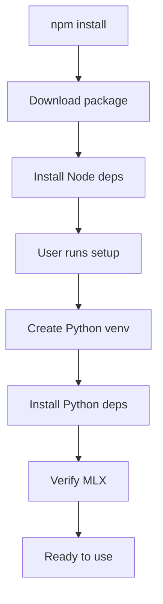

# Deployment Strategy - kr-serve-mlx

Complete guide for deploying kr-serve-mlx via npm.

## 🎯 Deployment Model

**Primary**: npm package (TypeScript + bundled Python requirements)
**Approach**: Hybrid package with postinstall automation

---

## 📦 Package Distribution

### What's Included in npm Package

```
@knowrag/kr-serve-mlx/
├── dist/                    # Compiled TypeScript (ESM + CJS)
├── python/                  # Python runtime + requirements
│   ├── runtime.py
│   └── requirements.txt
├── scripts/                 # Setup scripts
│   └── prepare-env.ts
├── package.json            # npm metadata
└── README.md
```

### What Users Need to Provide

- Node.js 20+
- Python 3.9 - 3.12
- **Apple Silicon M3 or later** (M3 Pro / M3 Max / M3 Ultra recommended)
- macOS 26.0+ (Metal 3.3+)

> **Important**: M1/M2 hardware is not officially supported. See [M3+ Strategy](./M3_PLUS_STRATEGY.md) for details.

---

## 🚀 Installation Flow

### User Experience

```bash
# Step 1: Install npm package
npm install @knowrag/kr-serve-mlx

# Step 2: Setup Python environment (one-time)
npx kr-serve-mlx setup
# or
npm exec kr-serve-mlx setup

# Step 3: Use in code
import { createEngine } from '@knowrag/kr-serve-mlx';
```

### What Happens During Installation



---

## 📋 package.json Configuration

### Publishing Fields

```json
{
  "name": "@knowrag/kr-serve-mlx",
  "version": "0.1.0",
  "description": "TypeScript MLX engine for Apple Silicon",
  "main": "./dist/index.js",
  "module": "./dist/index.mjs",
  "types": "./dist/index.d.ts",

  "bin": {
    "kr-serve-mlx": "./dist/cli.js"
  },

  "files": [
    "dist",
    "python",
    "scripts",
    "README.md",
    "LICENSE"
  ],

  "scripts": {
    "postinstall": "node scripts/postinstall.js",
    "setup": "tsx scripts/prepare-env.ts"
  },

  "engines": {
    "node": ">=20.0.0"
  },

  "os": ["darwin"],
  "cpu": ["arm64"],

  "keywords": [
    "mlx",
    "llm",
    "inference",
    "apple-silicon",
    "typescript"
  ],

  "repository": {
    "type": "git",
    "url": "https://github.com/knowrag/kr-serve-mlx.git"
  },

  "publishConfig": {
    "access": "public",
    "registry": "https://registry.npmjs.org/"
  }
}
```

---

## 🔧 Setup Scripts

### postinstall.js (Optional Check)

```javascript
#!/usr/bin/env node
/**
 * Postinstall script - provides guidance, doesn't auto-install Python
 */

const os = require('os');
const platform = os.platform();
const arch = os.arch();

console.log('📦 kr-serve-mlx installed successfully!');
console.log('');

// Check platform
if (platform !== 'darwin') {
  console.error('❌ Error: kr-serve-mlx requires macOS with Apple Silicon M3+');
  console.error('   Your system: ' + platform + ' / ' + arch);
  process.exit(1);
}

// Check architecture
if (arch !== 'arm64') {
  console.error('❌ Error: kr-serve-mlx requires Apple Silicon (ARM64)');
  console.error('   Your system: ' + platform + ' / ' + arch);
  process.exit(1);
}

// Check for M3+ (approximate check via macOS version)
const release = os.release();
const majorVersion = parseInt(release.split('.')[0]);

if (majorVersion < 25) {
  console.warn('⚠️  Warning: Your macOS version may not support Metal 3.3+');
  console.warn('   Required: macOS 26.0+ for optimal performance');
}
  console.warn('   Linux support is experimental.');
}

if (platform === 'darwin' && arch !== 'arm64') {
  console.warn('⚠️  Warning: MLX requires Apple Silicon M2 or later');
  console.warn('   Intel Macs and M1 are not supported.');
}

console.log('');
console.log('🐍 Next step: Setup Python environment');
console.log('   Run: npx kr-serve-mlx setup');
console.log('');
console.log('📚 Documentation: https://github.com/knowrag/kr-serve-mlx#readme');
```

### CLI Tool (scripts/cli.ts)

```typescript
#!/usr/bin/env tsx
/**
 * CLI tool for kr-serve-mlx
 */

import { execa } from 'execa';

const command = process.argv[2];

async function main() {
  switch (command) {
    case 'setup':
      console.log('🚀 Setting up kr-serve-mlx...\n');
      await import('./prepare-env.js');
      break;

    case 'verify':
      console.log('🔍 Verifying installation...\n');
      // Check Python venv
      // Check MLX version
      // Run simple test
      break;

    case 'clean':
      console.log('🧹 Cleaning Python environment...\n');
      await execa('rm', ['-rf', '.kr-mlx-venv']);
      console.log('✅ Cleaned');
      break;

    default:
      console.log('kr-serve-mlx CLI\n');
      console.log('Commands:');
      console.log('  setup   - Setup Python environment');
      console.log('  verify  - Verify installation');
      console.log('  clean   - Remove Python environment');
  }
}

main().catch(console.error);
```

---

## 🔄 Version Management

### Semantic Versioning

```
MAJOR.MINOR.PATCH

Examples:
0.1.0  - Initial MVP release
0.2.0  - Add draft model support
0.3.0  - Add Outlines integration
1.0.0  - Production ready, stable API
```

### Breaking Changes

When API changes require code updates:
- Bump MAJOR version
- Document in CHANGELOG.md
- Provide migration guide

### Python Dependencies

Lock Python versions in requirements.txt:
```
mlx==0.29.2
mlx-lm==0.24.2
# Use exact versions for stability
```

Update strategy:
- Test new MLX versions before updating
- Release as MINOR version if compatible
- Release as MAJOR if breaking changes

---

## 🚢 Publishing Process

### Pre-Release Checklist

- [ ] All tests passing
- [ ] Version bumped in package.json
- [ ] CHANGELOG.md updated
- [ ] README.md examples work
- [ ] Python requirements.txt verified
- [ ] Build successful (`npm build`)
- [ ] Types generated correctly
- [ ] Examples tested

### Manual Publishing

```bash
# 1. Clean and build
npm clean
npm install
npm build

# 2. Test package locally
npm pack
npm install -g knowrag-kr-serve-mlx-0.1.0.tgz
# Test installation

# 3. Publish to npm
npm login
npm publish --access public

# 4. Tag release
git tag v0.1.0
git push origin v0.1.0
```

### Automated Publishing (GitHub Actions)

```yaml
# .github/workflows/publish.yml
name: Publish to npm

on:
  release:
    types: [created]

jobs:
  publish:
    runs-on: macos-latest
    steps:
      - uses: actions/checkout@v4

      - uses: actions/setup-node@v4
        with:
          node-version: '20'
          registry-url: 'https://registry.npmjs.org'

      - uses: npm/action-setup@v2
        with:
          version: 8

      - name: Install dependencies
        run: npm install

      - name: Build
        run: npm build

      - name: Publish
        run: npm publish --access public
        env:
          NODE_AUTH_TOKEN: ${{ secrets.NPM_TOKEN }}
```

---

## 👥 User Installation Guide

### Quick Start

```bash
# Install package
npm install @knowrag/kr-serve-mlx

# Setup Python (one-time)
npx kr-serve-mlx setup

# Verify
npx kr-serve-mlx verify
```

### Detailed Installation

#### Prerequisites

1. **macOS 26.0+ with Apple Silicon M2+**
   ```bash
   # Check macOS version
   sw_vers  # Should show: ProductVersion 26.0 or higher

   # Check architecture
   uname -m  # Should show: arm64

   # Check CPU model
   sysctl -n machdep.cpu.brand_string  # Should show M2 or later
   ```

2. **Node.js 20+**
   ```bash
   node --version  # Should be v20.x.x or higher
   ```

3. **Python 3.11+**
   ```bash
   python3 --version  # Should be 3.11.x or higher
   ```

#### Step-by-Step

1. **Install npm package**
   ```bash
   npm install @knowrag/kr-serve-mlx
   ```

2. **Setup Python environment**
   ```bash
   npx kr-serve-mlx setup

   # This will:
   # - Create .kr-mlx-venv/ in your project
   # - Install mlx, mlx-lm, outlines, etc.
   # - Verify installation
   ```

3. **Test installation**
   ```bash
   npx kr-serve-mlx verify
   ```

4. **Use in your code**
   ```typescript
   import { createEngine } from '@knowrag/kr-serve-mlx';

   const engine = await createEngine();
   // Ready to use!
   ```

---

## 🐛 Troubleshooting Installation

### Python venv creation fails

```bash
# Manual setup
python3 -m venv .kr-mlx-venv
source .kr-mlx-venv/bin/activate
pip install -r node_modules/@knowrag/kr-serve-mlx/python/requirements.txt
```

### MLX installation fails

**Cause**: Not on Apple Silicon M2+
**Solution**: MLX with kr-serve-mlx requires M2 or later (M2/M3/M4)

### Permission errors

```bash
# Try with sudo (macOS)
sudo npx kr-serve-mlx setup

# Or change ownership
sudo chown -R $(whoami) .kr-mlx-venv
```

---

## 📊 Download Statistics

### npm Package Info

```bash
# View package info
npm view @knowrag/kr-serve-mlx

# Download stats
npm view @knowrag/kr-serve-mlx dist-tags
npm view @knowrag/kr-serve-mlx versions
```

---

## 🔐 Security

### Package Verification

Users can verify package integrity:
```bash
npm audit @knowrag/kr-serve-mlx
```

### Dependency Scanning

We use:
- Dependabot for npm dependencies
- pip-audit for Python dependencies
- Automated security updates

---

## 🎯 Future Enhancements

### Potential Additions

1. **Docker Image** (Phase 2)
   ```bash
   docker pull knowrag/kr-serve-mlx:latest
   docker run -v $(pwd):/app knowrag/kr-serve-mlx
   ```

2. **Homebrew Formula** (Phase 2)
   ```bash
   brew install kr-serve-mlx
   ```

3. **Binary Releases** (Phase 3)
   - Pre-compiled binaries for macOS
   - Bundled Python runtime

4. **PyPI Package** (Optional)
   - Companion Python package
   - For Python-first users

---

## 📝 Maintainer Notes

### Before Each Release

1. Update version in package.json
2. Update CHANGELOG.md
3. Test on clean macOS
4. Verify Python deps still work
5. Update docs if API changed
6. Tag release in git

### Post-Release

1. Monitor npm download stats
2. Watch for issues on GitHub
3. Update docs based on feedback
4. Plan next version

---

## 📚 Related Documentation

- [Installation Guide](../README.md#installation)
- [Migration Guide](./MIGRATION_GUIDE.md)
- [Development Guide](../GETTING_STARTED.md)
- [API Documentation](./API.md)

---

**Deployment Model**: ✅ npm-first, Python bundled
**Setup**: ✅ Semi-automatic (user runs setup command)
**Platforms**: ✅ macOS (primary), Linux (experimental)
